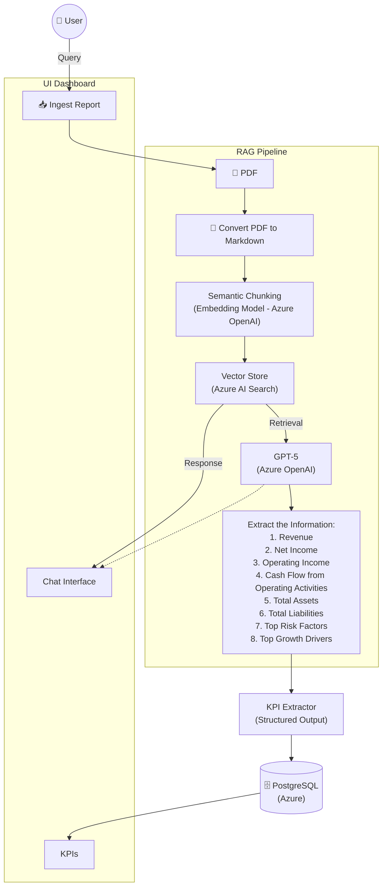
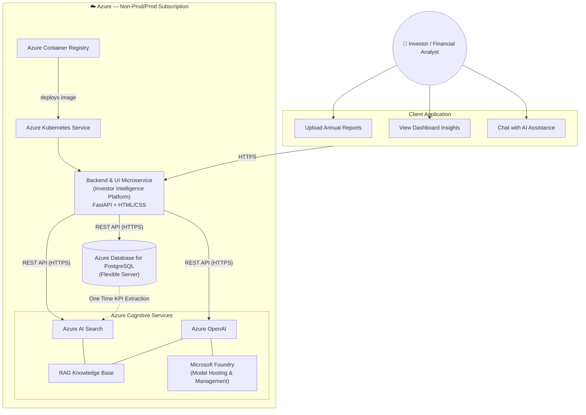

# AI-Powered Investor Intelligence Platform
## Logical Architecture Diagram

---

## Overview

This platform ingests investor/financial reports (PDF), extracts structured KPIs using an LLM-powered RAG pipeline, stores them in PostgreSQL, and surfaces them to users through a dashboard with a chat interface.

---

## Architecture Diagram (Mermaid)

---

## Component Breakdown

### 1. UI Dashboard
| Component | Description |
|---|---|
| **Ingest Report** | Entry point for uploading a report (e.g., PDF) into the pipeline |
| **KPIs** | Displays structured financial KPIs pulled from PostgreSQL |
| **Chat Interface** | Conversational interface for the user to query the report; receives responses from the RAG pipeline |

### 2. RAG Pipeline
| Step | Component | Description |
|---|---|---|
| 1 | **PDF** | Raw investor report uploaded by the user |
| 2 | **Convert PDF to Markdown** | Converts the PDF into structured Markdown for cleaner downstream processing |
| 3 | **Semantic Chunking** | Splits the Markdown into semantically meaningful chunks using an Azure OpenAI embedding model |
| 4 | **Vector Store (Azure AI Search)** | Stores chunk embeddings and enables retrieval based on similarity |
| 5 | **Retrieval → GPT-5 (Azure OpenAI)** | Retrieves relevant chunks and feeds them to GPT-5 for reasoning/extraction |
| 6 | **Extractor – the Information** | GPT-5 extracts key structured fields from the retrieved content |

### 3. Extracted KPI Fields
1. Revenue
2. Net Income
3. Operating Income
4. Cash Flow from Operating Activities
5. Total Assets
6. Total Liabilities
7. Top Risk Factors
8. Top Growth Drivers

### 4. KPI Extractor
- Takes the LLM's raw output and converts it into **Structured Output** (schema-validated JSON or similar).
- Passes structured data downstream to storage.

### 5. Storage: PostgreSQL (Azure)
- Persists structured KPI data.
- Serves as the source of truth for the **KPIs** panel in the UI Dashboard.

---

## Data Flow Summary

1. **User** submits a query / uploads a report via **Ingest Report**.
2. The **PDF** is converted to **Markdown**.
3. Markdown is **semantically chunked** and embedded.
4. Chunks are indexed in the **Vector Store (Azure AI Search)**.
5. On retrieval, relevant chunks are sent to **GPT-5** for extraction.
6. GPT-5 extracts the 8 key financial/informational fields.
7. The **KPI Extractor** converts this into **structured output**.
8. Structured output is saved to **PostgreSQL (Azure)**.
9. The UI Dashboard reads KPIs from PostgreSQL and displays them.
10. The **Chat Interface** gets conversational responses back from the RAG pipeline (vector store / LLM).

---

## Tech Stack

- **Database:** PostgreSQL (hosted on Azure)
- **LLM:** GPT-5 (Azure OpenAI)
- **Embeddings:** Azure OpenAI Embedding Model
- **Vector Search:** Azure AI Search
- **Document Processing:** PDF → Markdown conversion, semantic chunking
- **Frontend:** UI Dashboard with KPI panel + Chat Interface

## Physical Architecture Diagram

---

## Overview

This diagram shows the **physical/deployment architecture** on Azure — how the Investor Intelligence Platform is actually hosted, networked, and how components communicate over REST APIs within an Azure subscription.

---

## Architecture Diagram (Mermaid)

---

## Component Breakdown

### 1. Client Application (User-Facing)
| Component | Description |
|---|---|
| **Investor / Financial Analyst** | End user accessing the platform |
| **Upload Annual Reports** | UI action to upload a report (PDF) for processing |
| **View Dashboard Insights** | UI action to view extracted KPIs/insights |
| **Chat with AI Assistance** | UI action to converse with the RAG-powered assistant |

Communication to the backend happens over **HTTPS**.

### 2. Azure Subscription (Non-Prod/Prod)
| Component | Description |
|---|---|
| **Azure Container Registry (ACR)** | Stores container images for the platform, deployed into AKS |
| **Azure Kubernetes Service (AKS)** | Hosts and orchestrates the backend/UI microservice containers |
| **Backend & UI Microservice** | The Investor Intelligence Platform application — built with **FastAPI** (backend) + **HTML/CSS** (UI) |
| **Azure Database for PostgreSQL (Flexible Server)** | Stores structured KPI data; communicates with the backend via **REST API (HTTPS)** |

### 3. Azure Cognitive Services (RAG Knowledge Base)
| Component | Description |
|---|---|
| **Azure AI Search** | Vector/semantic search index powering retrieval for the RAG pipeline |
| **Azure OpenAI** | LLM used for generating chat responses and extracting KPIs |
| **Microsoft Foundry** | Model hosting and management layer for the AI models |

The backend communicates with **Azure AI Search** and **Azure OpenAI** via **REST API (HTTPS)**.

---

## Data & Communication Flow

1. **User** interacts with the client app (upload report / view dashboard / chat) over the browser.
2. Client app calls the **Backend & UI Microservice** (hosted on AKS) via **HTTPS**.
3. **ACR** supplies the container image that AKS runs for the backend/UI microservice.
4. Backend talks to:
   - **PostgreSQL (Flexible Server)** — via REST API (HTTPS) — for storing/reading structured KPI data.
   - **Azure AI Search** — via REST API (HTTPS) — for RAG retrieval.
   - **Azure OpenAI** — via REST API (HTTPS) — for LLM completions/chat.
5. **PostgreSQL → Azure AI Search**: a **one-time KPI extraction** step feeds relevant data into the RAG knowledge base index.
6. **Azure OpenAI** is hosted/managed via **Microsoft Foundry**, which handles model hosting and lifecycle management.

---

## Tech Stack

- **Compute / Orchestration:** Azure Kubernetes Service (AKS)
- **Image Registry:** Azure Container Registry (ACR)
- **Backend:** FastAPI
- **Frontend:** HTML/CSS (served by the same microservice)
- **Database:** Azure Database for PostgreSQL (Flexible Server)
- **Search / Retrieval:** Azure AI Search
- **LLM:** Azure OpenAI
- **Model Management:** Microsoft Foundry
- **Transport:** REST APIs over HTTPS throughout

---

## Notes: Logical vs. Physical View

- The **logical architecture** (previous diagram) describes the *data/processing pipeline*: PDF → Markdown → chunking → embeddings → vector store → LLM extraction → structured KPIs → PostgreSQL → dashboard.
- This **physical architecture** describes *where and how that logic is deployed*: containerized microservice on AKS, backed by Azure PostgreSQL and Azure Cognitive Services, all within an Azure subscription, communicating over REST/HTTPS.